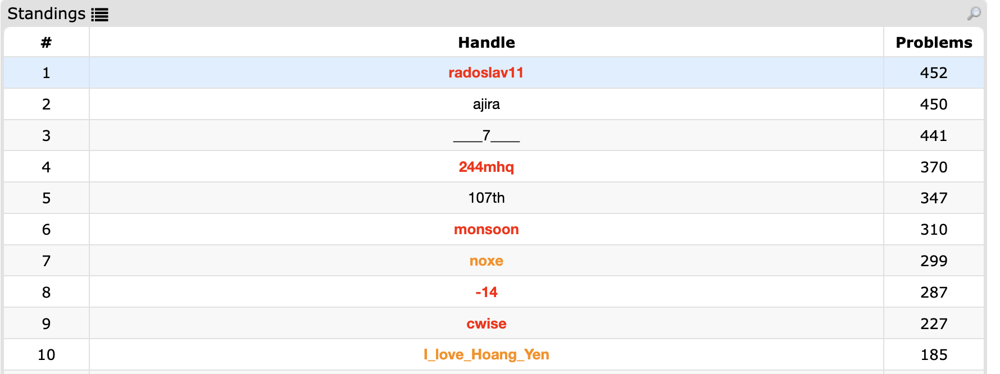

# ACM SGU Competitive Programming Solutions with LLM Enhancement

This repository contains solutions to ACM SGU (Saratov State University) competitive programming problems, enhanced with detailed editorials and reasoning explanations generated using advanced language models. The full page about the project is [here](https://radoslav11.com/sgu-dataset/).

The repository covers **452 of the 453** SGU problems. The only one missing is [problem 145](https://codeforces.com/blog/entry/59070?#comment-1360108), which currently appears to be broken on the judge: there are no passing solutions, and the checker seems to reject any path other than the single one it expects, even though the statement says "if there exist many solutions output any of them".

The editorials were written with a variety of GPT models (OpenAI's o1, o3, and the GPT-5 series). For the later problems, some of the implementation was done with the help of coding agents (namely Claude Code and Codex) based on a solution idea and outline I had provided.



## Overview

The repository consists of two main components:

1. **Original Solutions**: Competitive programming solutions to SGU problems in C++ or Python.
2. **Enhanced Editorials**: Comprehensive problem explanations, solution approaches, and detailed editorials generated using a range of GPT models.

## Dataset Structure

```
dataset/
├── p100.txt          # Enhanced editorial with solution approach
├── p100_raw.txt      # Original source code solution + statemtent + sample input/output
├── p100_finetune.txt # Example finetuning format
├── p101.txt          # Enhanced editorial with solution approach
├── p101_raw.txt      # Original source code solution + statemtent + sample input/output
├── p101_finetune.txt # Example finetuning format
└── ...               # Additional problems (452 of the 453 problems covered)
```

Each enhanced editorial (`p*.txt`) contains:
- Concise problem statement.
- Detailed solution approach and algorithm explanation.
- Step-by-step implementation guide.
- Time/space complexity analysis.
- Alternative solution methods.
- C++ and Python reference implementations.

## Enhanced Editorial Format

The editorials follow a structured format:
1. **Abridged Problem Statement**: Clear, concise problem description.
2. **Detailed Editorial**: Algorithm explanation, key insights, and approach.
3. **Implementation Details**: Step-by-step coding guidance.
4. **Reference Solutions**: One solution in C++ and one in Python.
5. **Compressed Editorial**: Quick summary for experienced programmers.

## File Structure

```
src/
├── process_problems.py          # Script to process my raw solutions and statments.
├── create_dataset.py            # After processing the problems, creates the actual dataset.
└── requirements.txt             # Python dependencies.

problems/
├── p*/
├───── statement.txt            # Original problem statement.
└───── p*.{cpp,py}              # The original solution in C++ or Python.

dataset/
├── p*.txt                      # Enhanced editorials.
├── p*_finetune.txt             # Formatted data for training.
└── p*_raw.txt                  # All data from the corresponding problems/ directory.
```

## Future Work

- Extended dataset with more competitive programming platforms.
- Attempt direct integration with online judge systems.

## Citing This Work

If you use this dataset please cite:

```bibtex
@misc{dimitrov2025sgu,
  title={SGU-Editorial: A Small Dataset of Competitive Programming Problems with LLM-Enhanced Editorials},
  author={Radoslav Dimitrov},
  year={2025},
  url={https://radoslav11.com/sgu-dataset/sgu-editorial.pdf}
}
```

[](https://doi.org/10.5281/zenodo.18146471)


## Acknowledgments

- SGU (Saratov State University) for the original problem set.
- OpenAI for their GPT models used in editorial generation, and for Codex.
- Anthropic for Claude Code.
